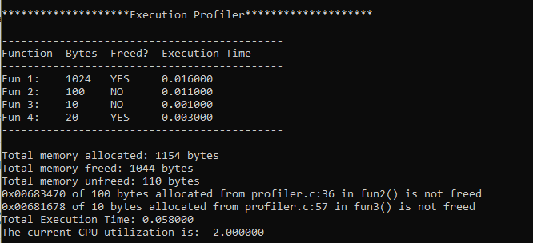

# Execution-Profiler
Execution Profiler that profiling of given code

In software engineering, profiling ("program profiling", "software profiling") is a form of dynamic program analysis that measures, for example, the space (memory) or time complexity of a program, the usage of particular instructions, or the frequency and duration of function calls. Most commonly, profiling information serves to aid program optimization.

Profiling is achieved by instrumenting either the program source code or its binary executable form using a tool called a profiler (or code profiler). Profilers may use a number of different techniques, such as event-based, statistical, instrumented, and simulation methods.

This Execution Profiler provides the following profiling information:

* Memory allocated to the function
* Detecting Memory Leaks
* Total Freed & Unfreed memory
* Execution Time 

### Output

